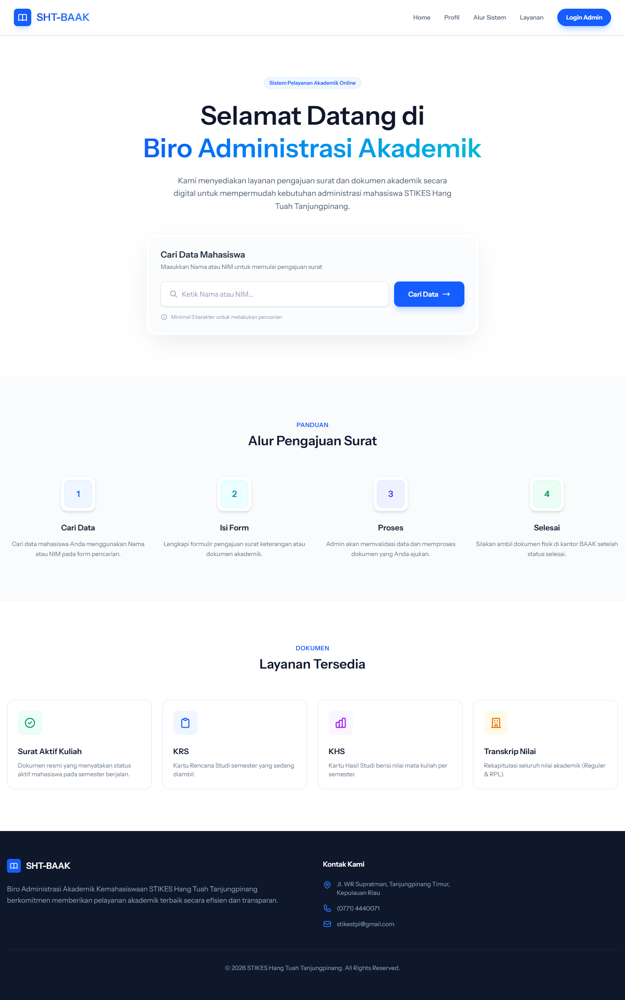
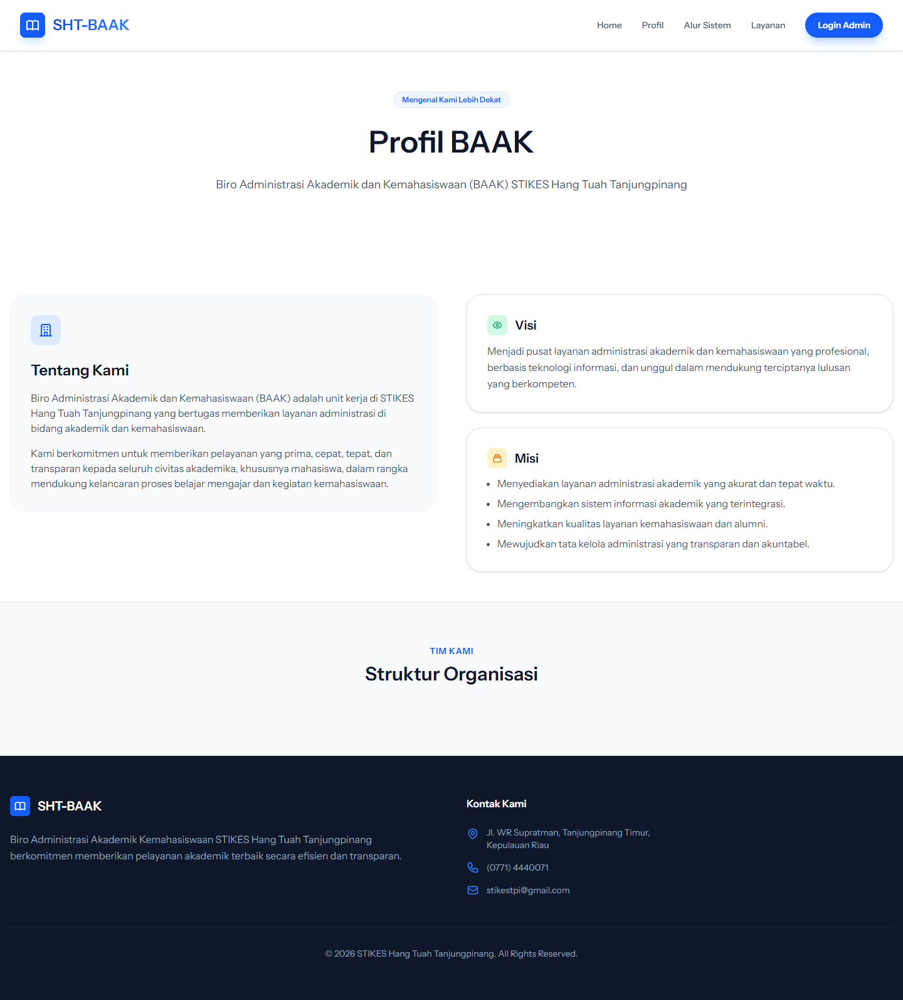
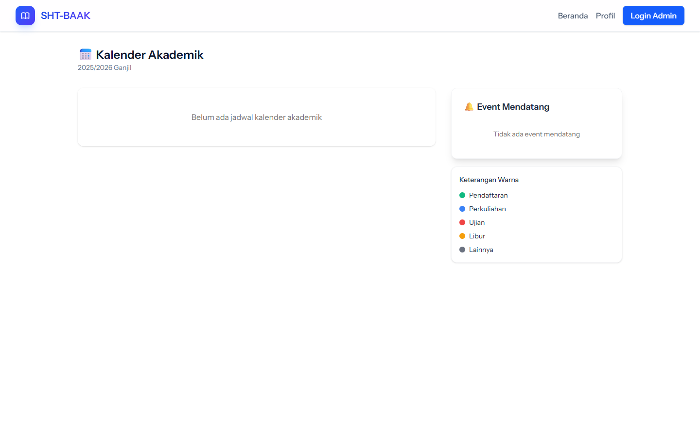
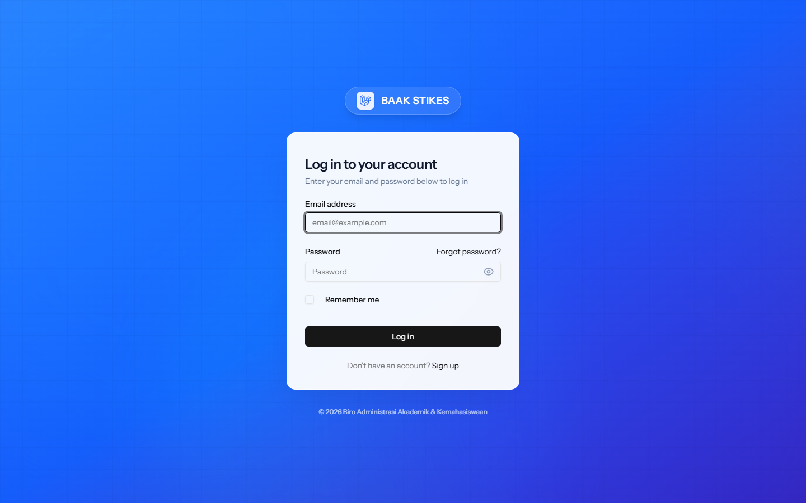
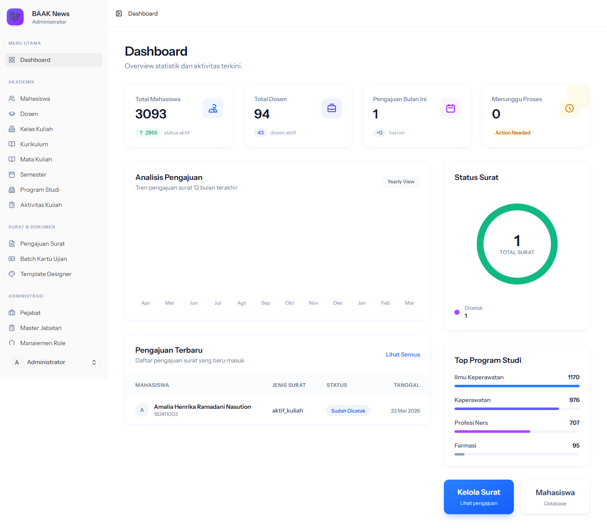
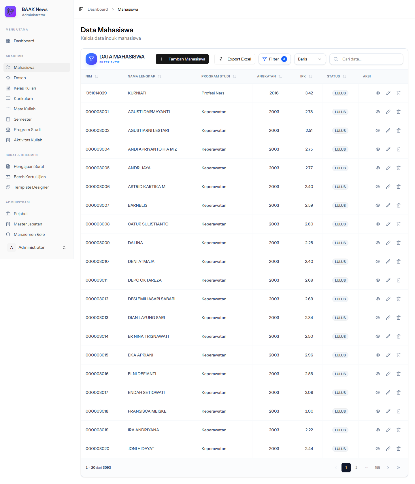
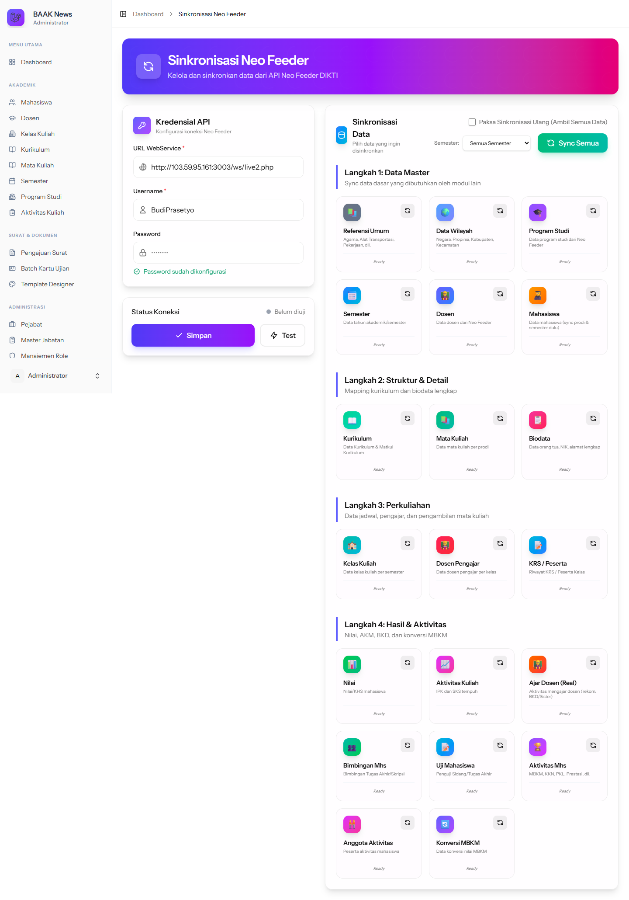

# BAAK News - Sistem Informasi Akademik & Kemahasiswaan

Aplikasi **BAAK News** adalah platform terintegrasi untuk Biro Administrasi Akademik dan Kemahasiswaan (BAAK) yang dibangun menggunakan spesifikasi teknologi modern. Sistem ini mendukung sinkronisasi dengan **Neo Feeder PDDIKTI** dan menyediakan layanan mandiri (self-service) bagi mahasiswa untuk mencetak dokumen penting secara online.

## 🚀 Fitur Utama

### 1. Portal Layanan Mandiri Mahasiswa (Self-Service)
- **Verifikasi Identitas:** Keamanan akses dokumen mahasiswa.
- **Cetak Dokumen Akademik:**
  - Kartu Rencana Studi (KRS)
  - Kartu Hasil Studi (KHS)
  - Kartu Ujian
  - Transkrip Nilai
- **Pengajuan Surat:** Mahasiswa dapat mengajukan dokumen/surat secara online yang kemudian diproses oleh staf BAAK.
- **Pemilihan Dosen Wali:** Modul untuk mahasiswa memilih dosen wali masing-masing.

### 2. Dashboard Admin & Staf BAAK
- **Manajemen Data Induk:**
  - Data Mahasiswa, Dosen, Pejabat, dan Pengguna.
  - Data Akademik (Mata Kuliah, Kurikulum, Semester, Program Studi).
- **Manajemen Kelas Kuliah & Jadwal.**
- **Persetujuan (Approval) Surat Pengajuan:** Fitur untuk menyetujui, menolak, maupun memproses pengajuan surat secara massal (bulk approve/reject).
- **Template Surat (Designer):** Kustomisasi template dokumen cetak menggunakan PDF.
- **Kalender Akademik:** Pengaturan dan publikasi kalender akademik.

### 3. Integrasi Neo Feeder PDDIKTI
- Pengaturan koneksi (Host, Token) ke Neo Feeder.
- **Sinkronisasi Otomatis/Manual** untuk berbagai entitas:
  - Referensi, Program Studi, Semester, Kurikulum, Mata Kuliah.
  - Biodata Mahasiswa, Riwayat Pendidikan (Lulus/DO).
  - Dosen, Penugasan Dosen (Ajar Dosen, Dosen Pengajar).
  - Kelas Kuliah, Nilai, KRS, Aktivitas Kuliah.
  - Aktivitas Mahasiswa, Bimbingan, Uji Mahasiswa, dan Konversi Kampus Merdeka.

## 🛠️ Stack Teknologi

- **Backend:** Laravel 12 (PHP ^8.2)
- **Frontend / SPA:** Vue.js 3 + Inertia.js 2.0
- **UI / Styling:** Tailwind CSS v4, PrimeVue, Reka UI, Lucide Icons
- **PDF Generation:** DOMPDF, FPDF, FPDI
- **Excel/Word Handling:** Maatwebsite Excel, PHPOffice PHPWord
- **Role & Permission:** Spatie Laravel Permission
- **Build Tool:** Vite v7

## 📦 Panduan Instalasi

1. **Clone repositori ini:**
   ```bash
   git clone <repo-url>
   cd baak-news
   ```

2. **Install dependensi PHP & Node.js:**
   ```bash
   composer install
   npm install
   ```

3. **Konfigurasi Environment:**
   Salin file `.env.example` ke `.env` lalu sesuaikan konfigurasi database.
   ```bash
   cp .env.example .env
   php artisan key:generate
   ```

4. **Migrasi Database & Seeder:**
   ```bash
   php artisan migrate --seed
   ```

5. **Jalankan Aplikasi:**
   Untuk development (menjalankan server PHP dan Vite secara bersamaan):
   ```bash
   npm run dev
   # Atau jika menggunakan perintah composer bawaan kit:
   composer run dev
   ```
   Aplikasi dapat diakses melalui `http://localhost:8000`.

## 📸 Dokumentasi Layar (Screenshots)

Berikut adalah tangkapan layar (screenshots) dari menu utama aplikasi:

### Halaman Publik
| Landing Page | Profil BAAK |
| :---: | :---: |
|  |  |

| Kalender Akademik | Halaman Login |
| :---: | :---: |
|  |  |

### Halaman Admin & Sistem
| Dasbor Admin | Manajemen Mahasiswa |
| :---: | :---: |
|  |  |

| Sinkronisasi Neo Feeder |
| :---: |
|  |

## 🧑‍💻 Kontributor
- Framework dasar menggunakan Laravel Vue Starter Kit.
- [Tambahkan nama staf / developer BAAK di sini]

## 📄 Lisensi
Sistem ini merupakan sistem manajemen internal untuk keperluan akademik.
